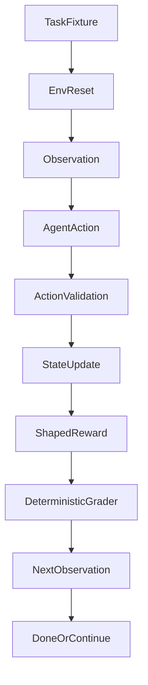

# Procurement Invoice Audit OpenEnv Plan

## Objective

Build a complete OpenEnv benchmark that simulates accounts-payable invoice auditing with balanced structured actions, deterministic graders, and reproducible baseline evaluation across easy/medium/hard tasks.

## Proposed Project Structure

- Core package
  - [invoice_audit_env/**init**.py](invoice_audit_env/__init__.py): public exports for env/models/tasks.
  - [invoice_audit_env/models.py](invoice_audit_env/models.py): typed Pydantic `Observation`, `Action`, `Reward`, and domain entities.
  - [invoice_audit_env/state.py](invoice_audit_env/state.py): runtime episode state, counters, queue management, reset snapshots, and deterministic RNG/seed plumbing.
  - [invoice_audit_env/reward.py](invoice_audit_env/reward.py): dense reward shaping + penalties.
  - [invoice_audit_env/graders.py](invoice_audit_env/graders.py): deterministic score functions in `[0.0, 1.0]`.
  - [invoice_audit_env/tasks.py](invoice_audit_env/tasks.py): easy/medium/hard deterministic fixtures, including clean no-action-needed invoices per task.
  - [invoice_audit_env/env.py](invoice_audit_env/env.py): OpenEnv-compliant `step()`, `reset(task_id, seed)`, `state()` implementation with required `info` dict.
- Validation/tests
  - [tests/test_openenv_contract.py](tests/test_openenv_contract.py): `reset()` observation validity, `step()` 4-tuple shape, `state()` consistency, and `info` keys.
  - [tests/test_reward_and_episode.py](tests/test_reward_and_episode.py): reward progression, unsafe-approval penalty, correct-escalation reward, loop penalties, max-step termination.
  - [tests/test_graders.py](tests/test_graders.py): deterministic scoring for all tasks with perfect path (`1.0`) and worst path (`0.0`) assertions.
- Runtime & metadata
  - [openenv.yaml](openenv.yaml): explicit OpenEnv metadata schema required for validation (name/version/tasks/spaces).
  - [inference.py](inference.py): root baseline script using OpenAI client + mandatory `[START]/[STEP]/[END]` logs.
  - [requirements.txt](requirements.txt): pinned runtime deps.
  - [Dockerfile](Dockerfile): explicit HF-compatible container recipe using `uvicorn` on port `7860`.
  - [app.py](app.py): FastAPI entrypoint exposing `/`, `/reset`, `/step`, `/state` endpoints for HF ping + env interaction.
  - [README.md](README.md): HF Space frontmatter (`sdk: docker`, `tags: [openenv]`) plus environment motivation, spaces, tasks, setup, validation, baseline scores.

## Architecture and Data Flow




## Action Space (Balanced)

- Core action enum with structured payload:
  - `review_invoice(checks: list[str])`
  - `request_correction(reason_code: str, note: str)`
  - `approve_invoice(approval_code: str)`
  - `escalate_case(escalation_type: str, evidence_refs: list[str])`
  - `ask_vendor_question(question: str)`
- Action model includes calibration fields:
  - `confidence: float` constrained to `[0.0, 1.0]`
  - `reasoning: str`
- Validation rules reject impossible/destructive transitions and emit penalty signals.

## Task + Grader Design

- **Easy:** single mismatch (PO vs invoice amount) with one correct correction flow.
- **Medium:** multi-constraint policy issue (tax + due date + approval threshold) requiring correct routing.
- **Hard:** invoice splitting fraud detection scenario (multiple sub-threshold invoices, shared vendor/time window, policy-evasion pattern) requiring escalation logic.
- Each task fixture set includes at least one clean invoice requiring direct approval to prevent trivial "always flag" exploitation.
- `max_steps` per task: easy `6`, medium `8`, hard `10`.
- Graders score checklist coverage + final disposition correctness, clamped and rounded to `[0.0, 1.0]`.

## Reward Shaping Plan

- Positive incremental rewards:
  - correct field validation checkpoints
  - correct intermediate routing choices
  - high-confidence final action aligned with ground truth
- Negative rewards:
  - repeated no-op loops
  - contradictory actions
  - unsafe approval when escalation required
- Calibration shaping:
  - modest bonus when correct actions are paired with appropriately high `confidence`
  - mild penalty when correct actions are repeatedly submitted with very low `confidence`
  - stronger penalty for high-confidence incorrect approvals/escalations
- Episode reward trajectory remains informative before terminal step.

## OpenEnv Contract Details (Required)

- `reset(task_id: str, seed: int | None = None) -> Observation` returns deterministic initial observation for selected task and seed.
- `step(action: Action) -> tuple[Observation, Reward, bool, dict]` always returns 4 values.
- `state() -> dict` returns current environment state (task, progress, audit trail, step counters, terminal flags).
- `info` payload contract:

```python
info = {
    "last_action_error": None,   # or error string
    "step_num": n,
    "task_id": "easy_single_mismatch",
    "grader_score": 0.0,         # populated when done=True, else None
}
```

## Baseline Inference + Reproducibility

- `inference.py` at repo root reads `API_BASE_URL`, `MODEL_NAME`, `HF_TOKEN`.
- Uses OpenAI client for all LLM calls and runs all 3 tasks in explicit sequence with fixed seeds/temperature settings.
- Emits strict stdout line formats exactly as required.
- Produces per-task and aggregate score summaries reproducibly.
- Mandatory loop shape:

```python
for task_id in ["easy_single_mismatch", "medium_policy_tangle", "hard_fraud_detection"]:
    obs = env.reset(task_id=task_id, seed=seed_map[task_id])
    print(f"[START] task={task_id} env=openenv-invoice-audit model={MODEL_NAME}")
    # step loop...
    # print [STEP] after every env.step using info["last_action_error"]
    print(f"[END] success={success} steps={steps} rewards={reward_csv}")
```

## Deployment and Validation

- Docker workflow: `docker build` + `docker run` with app startup and health/ping route.
- HF Space-ready app configuration and OpenEnv tag metadata.
- Validation checklist embedded in README using `openenv validate` + local smoke test commands.
- `app.py` endpoint contract:
  - `GET /` -> `200` health response.
  - `POST /reset` -> initial observation.
  - `POST /step` -> observation, reward, done, info.
  - `GET /state` -> current state snapshot.

### Dockerfile Baseline (Hard Requirement)

```dockerfile
FROM python:3.11-slim
WORKDIR /app
COPY requirements.txt .
RUN pip install --no-cache-dir -r requirements.txt
COPY . .
CMD ["uvicorn", "app:app", "--host", "0.0.0.0", "--port", "7860"]
```

- Container must listen on port `7860` for HF Space ping validation.

### HF Space README Frontmatter (Hard Requirement)

```yaml
---
title: openenv-invoice-audit
emoji: 🧾
colorFrom: blue
colorTo: green
sdk: docker
pinned: false
tags:
  - openenv
---
```

## openenv.yaml Minimum Schema (Hard Requirement)

```yaml
name: openenv-invoice-audit
version: "1.0.0"
tasks:
  - id: easy_single_mismatch
    difficulty: easy
  - id: medium_policy_tangle
    difficulty: medium
  - id: hard_fraud_detection
    difficulty: hard
    description: invoice splitting fraud detection
observation_space:
  type: object
  fields: [invoice_id, vendor_name, amount, tax_code, due_date, po_number, risk_level, audit_trail]
action_space:
  type: enum
  values: [review_invoice, request_correction, approve_invoice, escalate_case, ask_vendor_question]
```

## Implementation Phases

1. Implement `app.py` API contract (`/`, `/reset`, `/step`, `/state`) and confirm response schemas.
2. Author explicit `openenv.yaml` schema and validate locally with `openenv validate`.
3. Implement env lifecycle with deterministic `seed` support and required `info` dict in `step`.
4. Add clean-invoice fixtures and enforce task-specific `max_steps` boundaries.
5. Implement dense reward shaping + deterministic graders with terminal `grader_score`.
6. Build `inference.py` strict task loop and exact `[START]/[STEP]/[END]` formatting per task.
7. Add/expand tests for contract, grader extrema, reward safety checks, and episode limits.
8. Finalize Docker/HF assets and README submission checklist, including mandatory Space frontmatter.

## Risks and Mitigations

- **Spec drift risk:** add contract tests enforcing model/schema and API return signatures.
- **Non-deterministic graders:** keep graders pure and fixture-driven; avoid model-in-the-loop grading.
- **Format rejection risk (stdout):** centralize log line formatter and test exact strings.
- **Runtime limit risk:** cap max steps and prompt size; include timeout-safe defaults.
- **Gate-1 deploy risk:** enforce health endpoint `GET /` and smoke-test `/reset` after container start.

